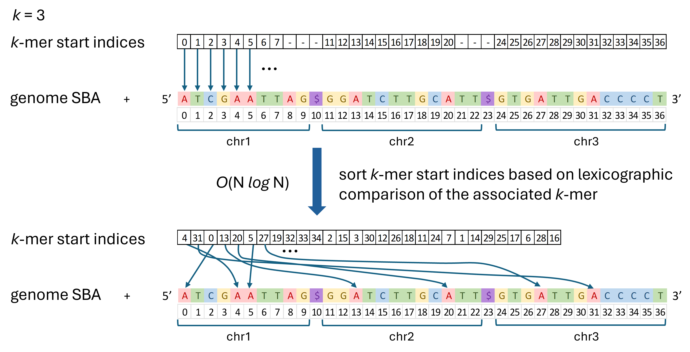
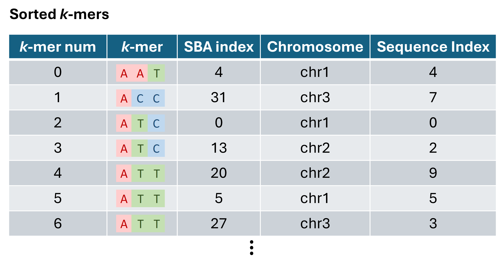
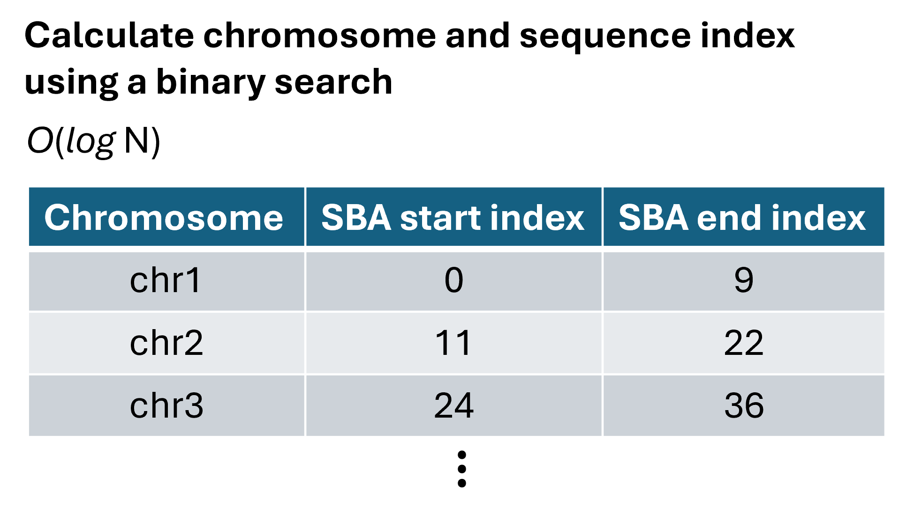

Algorithm
#########

Motivation
==========

Generating *k*-mer statistics is straightforward for small genomes. For example, let's say you want to determine which 20-mers occur exactly once in the genome. Simplifying the problem by only considering the forward strand and a single chromosome, the following Python snippet would work.

.. code-block:: python

    from collections import Counter

    genome = "AGGGGTCAATCACAATGCAAGATCCCTAATTCGAT" # example sequence
    k = 4
    counter = Counter()
    for i in range(0, len(genome) - k + 1):
        kmer = genome[i : i + k]
        counter[kmer] += 1

    unique_kmers = [kmer for kmer, count in counter.items() if count == 1]
    num_unique_kmers = len(unique_kmers)
    num_kmers = sum([count for count in counter.values()])
    print(f"num unique kmers: {num_unique_kmers}")
    print(f"num kmers: {num_kmers}")

In practice, this implementation runs into performance issues on larger genomes.  To see this, consider the amount of memory required to store just the *k*-mer keys.  Back-of-the-envelope, we need one byte per character in each "kmer" key. We can approximate the number of kmer keys as the number of base pairs in the genome (N) for k >= 20, since it is likely that most 20-mers are unique.  This means we would need O(Nk) memory just to store the keys, which for 20-mers in the human genome would be (3e9)(20) bytes ~ 60 Gb.  This is without even considering the memory required to store the counts and the memory overhead for the Python objects.

Another weakness to this approach is that looping in Python is slow relative to compiled languanges, and it would take a very long time for this to run on a larger genome.  This can be sped up by orders of magnitude by using NumPy array functions and numba's jit compiler where possible.

Finally, note that we do not have an easy way to determine the location of each unique *k*-mer, just its sequence.  It would be ideal if we had a solution that allowed us access to this information, without exacerbating the memory issue.

Read on for a data structure and an algorithm that addresses these issues.

Implementation
==============

A graphic depicting the basic algorithm for a simple example with *k* = 3 is is shown below.  

**Basic Algorithm**

- **load genome sequence into memory.** Store all the sequences in one large NumPy array (called the Sequence Byte Array, or SBA), separating each by a "$".
- **initialize k-mer start indices.**  Store all valid *k*-mer start indices in a NumPy array as unsigned 32-bit integers)
- **sort k-mer start indices.** Sort based on lexicographic comparison of *k*-mers defined by the start indices. This is done using a numba @jit quicksort function for O(N *log* N) sort time.

Once you have completed these steps, it is possible to do many of the downstream *k*-mer calculations, such as calculating genome-wide *k*-mer frequencies, uniqueness, etc.  These can generally be accomplished in O(N) time by walking through the sorted list of *k*-mers once.  Since all identical *k*-mers will be adjacent to each other in the sorted array, it is straightforward to count the number of times that each *k*-mer occurs.

If needed, it is also straightforward to generate the location information for each *k*-mer (strand, chromosome, and sequence index).  You need only do a binary search on a list of chromosome start/end indices, which takes O(*log* M) time, where M is the number of chromosomes.

This approach has several advantages:

1) **It uses minimal memory.**  Since the *k*-mer is defined by its start location, memory usage no longer scales with *k*. For most genomes, it is sufficient to use an unsigned 32-bit integer for each *k*-mer, which requires O(4N) bytes of memory total (N = genome length).  However, since the genome is also loaded in memory, an additional O(N) bytes of memory is required (at one byte per base if we do not used a compressed representation).  This gives a total of O(5N) bytes of memory required.  For the human genome, this is large, but acceptable: (5)(3e9) = 15 Gb.  And it has the advantage of remaining fixed even as *k* increases.
2) **It does not require a separate data structure to count k-mers.**  It is possible to avoid using a separate data structure to count the number of occurrences for each *k*-mer.  If the list of *k*-mer start indices is first sorted lexicographically by their corresponding *k*-mer, then you can walk along the sorted list and If you sort the kmer start indices by their
3) **It captures the location of the k-mer.** Since the kmer start index points to the start location in the genome, we need only do a quick binary search to identify which chromosome it belongs to.
