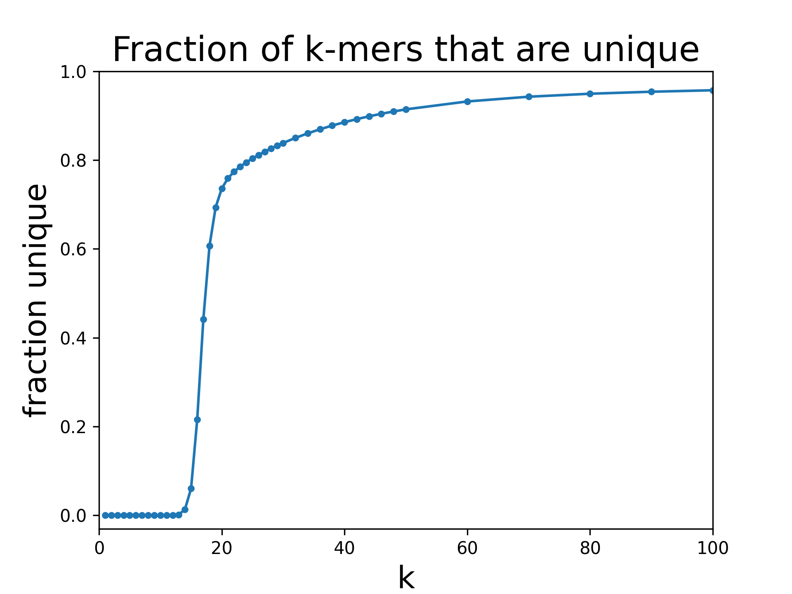
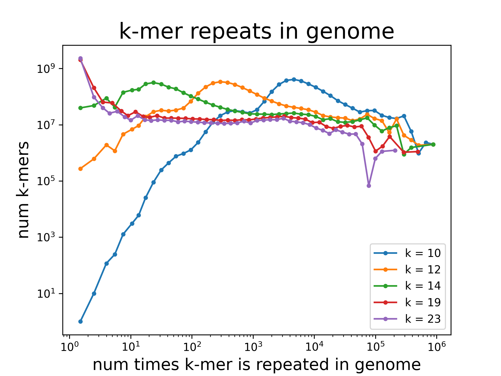

Examples
########

Plot unique *k*-mers as a function of *k*
=========================================

Calculate the number of *unique* *k*-mers as a function of *k* in the human genome.  A *k*-mer is considered unique if it occurs exactly once.  `See Example <https://github.com/mrperkett/genome-kmers-applications/blob/main/get_unique_kmers.ipynb>`_

Plot distribution of *k*-mer group sizes
========================================

For all *k*-mers in the human genome, calculate the distribution of *k*-mer *group sizes*.  The *k-mer group size* is defined as the number of times the *k*-mer sequence appears in the genome.  `See Example <https://github.com/mrperkett/genome-kmers-applications/blob/main/get_kmer_group_size_distribution.ipynb>`_

.. Generate candidate CRISPR guides
.. ================================

.. .. figure:: resources/human-kmer-repeats-plot.png
..     :width: 400

.. Save all candidate SpyCas9 guides that target the human genome exactly once. A valid SpyCas9 CRISPR guide is a 20-mer, followed by an NGG, that targets the genome exactly once. :ref:`See Example<Example Generate candidate CRISPR guides>`