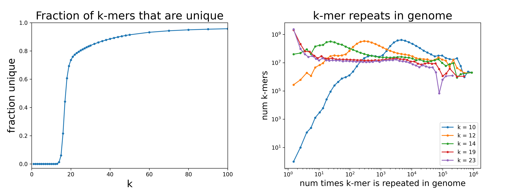
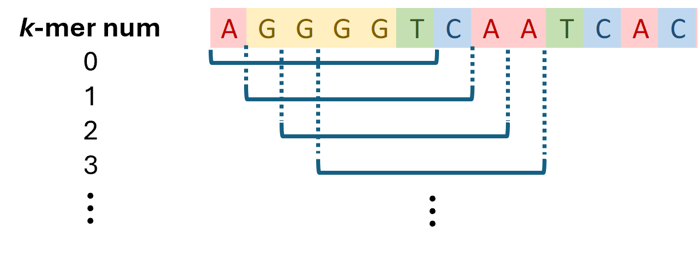

Welcome to genome-kmers's documentation!
========================================

This package contains a collection of classes and methods useful for generating memory efficient *k*-mer statistics for a genome. Qualitatively, all the *k*-mers for a genome can be visualized as the sequence defined by a sliding window of width *k*.

Generating statistics is straightforward for smaller genomes (e.g. counting the number of unique 20-mers), but requires a different computational approach at the size of the human genome, which is around 3e9 base pairs. This package provides an efficient implementation with a simple user interface.

.. toctree::
    :maxdepth: 2

    Overview <overview>
    Algorithm <algorithm>
    Examples <examples>
    API Reference <genome_kmers>
    Development <development>

* :ref:`genindex`
